# 🦷 DentPilot — clinic booking bot + reception journal

A self-hosted appointment system for small dental clinics (built with the Moldovan market
in mind): a **messenger-style booking chat** for patients (Romanian + Russian) and a
**reception journal** for the clinic — both on one database, so there is nothing to
synchronize. Bot bookings appear in the journal instantly, and manual entries instantly
block the slot in the bot.

Two editions from one codebase: a **desktop app** (`DentPilot.exe`, SQLite next to the
exe, one clinic, one Windows machine) and a **cloud** stack (Docker + PostgreSQL, one VPS
serving many clinics). The desktop edition is the one clinics actually install.

> Screenshots and `clinic.json` in this repo use synthetic data — invented patients,
> invented doctors. One `clinic.json` = one clinic.

## Screenshots

**Patient card** — odontogram, treatment plan and the activity feed, with allergies and
implant count pinned in the header:

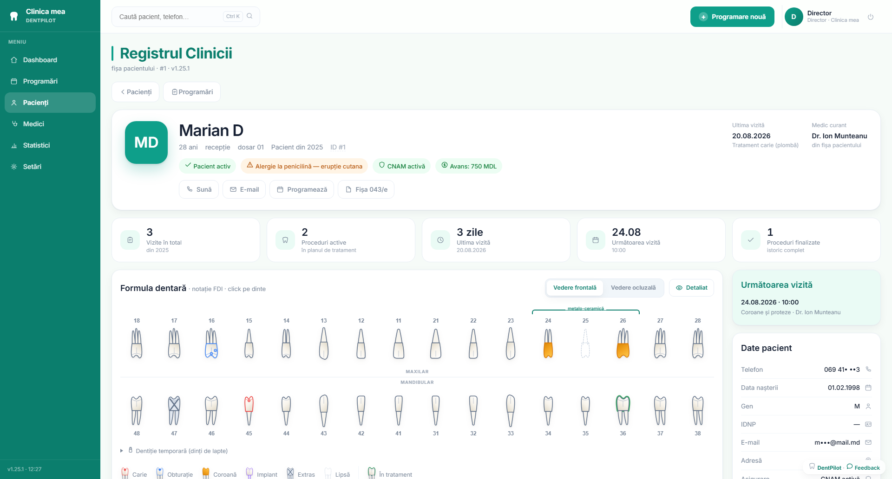

**Dashboard** — the day timeline: one column per doctor, blocks drawn to scale by duration,
the "now" line, tiles with a trend against yesterday, and the "new from the bot" rail:

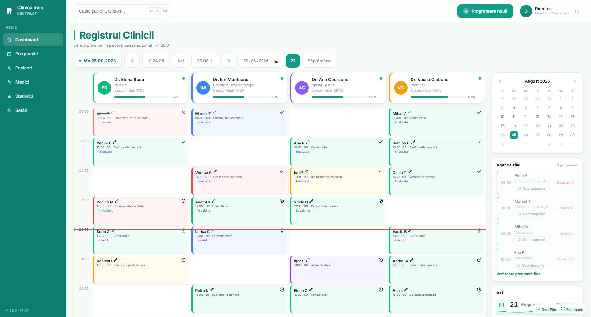

**Patient books from a phone** — opened via the QR page / a link in the clinic's Instagram bio:

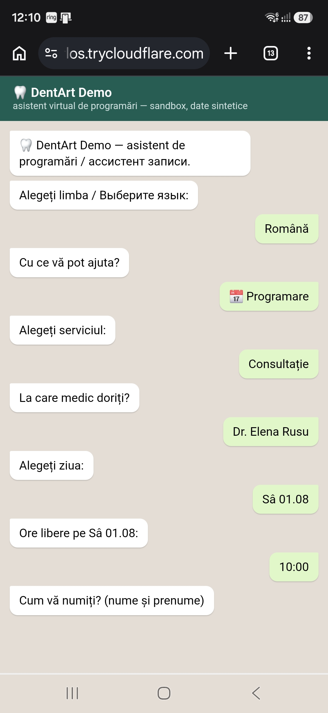

**Clinic journal — full day, every source in one grid** (🤖 bot · ✍️ reception · 📝 note blocking a slot · 🆘 urgent highlighted):

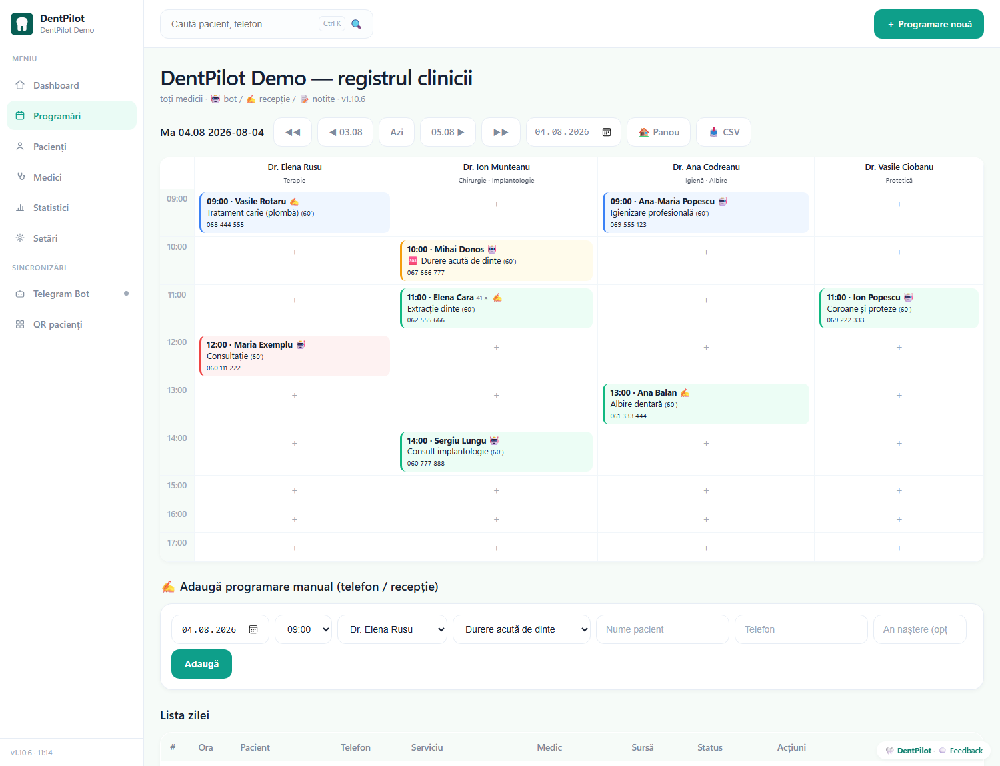

**Week view** — seven columns of chips with a per-week total:

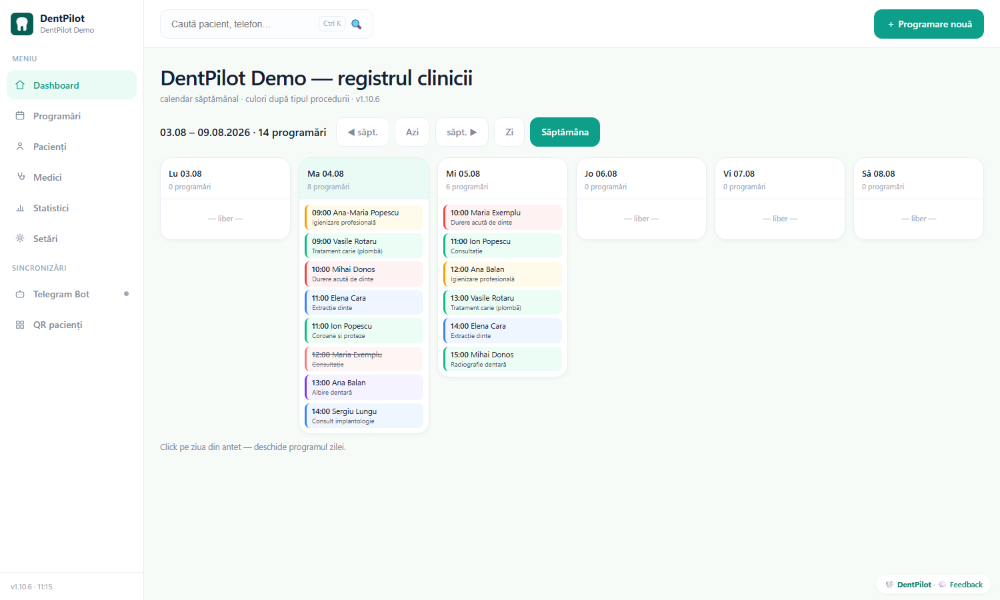

**Doctors** — one card per doctor with state, load and 30-day figures:

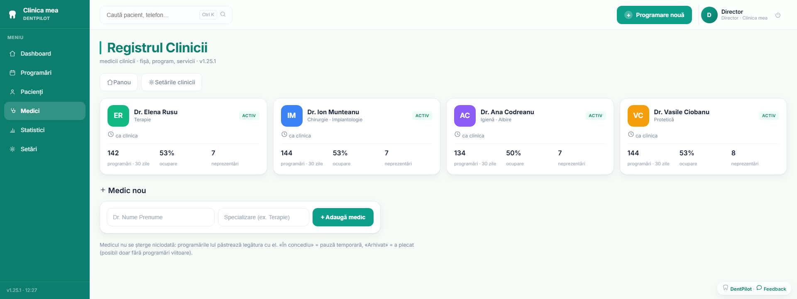

**Click "+" on any free slot** — book a patient or leave a note that blocks the slot for the bot too:

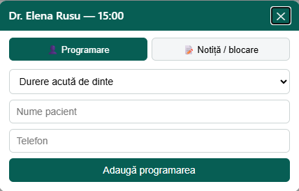

**Owner stats** — no-shows priced in MDL from the clinic's own price list, value brought
by the bot, per-doctor occupancy:

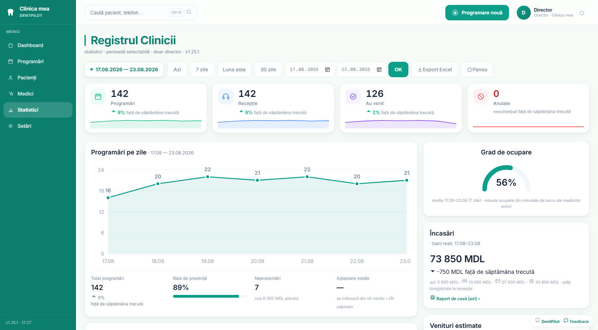

**Patient search** by name or phone digits, ignoring diacritics, with recent visits:

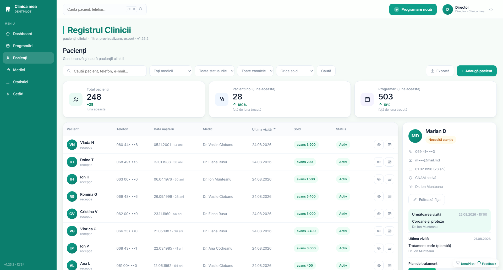

**Per-doctor day view** and the **live-demo QR page** (temporary Cloudflare tunnel):

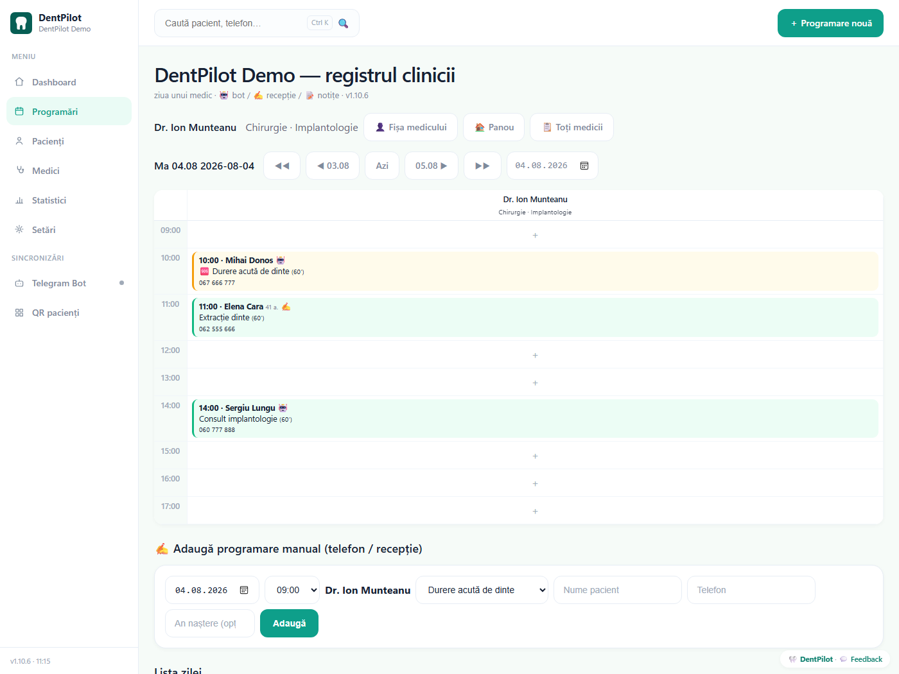

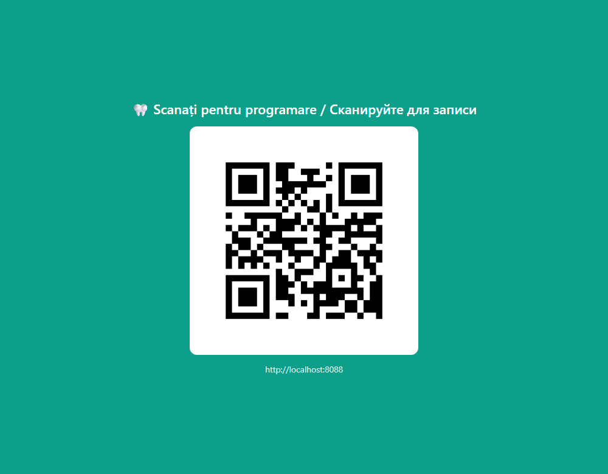

## Patient side (web chat + Telegram, RO/RU)

- The first screen is the **language choice** (Română / Русский); everything after it,
  including reminders, stays in that language.
- Full booking dialog: service → doctor (or *any available*) → day → time → name/phone → confirm.
- **Service→doctor mapping**: extractions go to the surgeon, cleanings to the hygienist;
  if only one doctor performs a service, the bot skips the question entirely. A service
  whose performers are all on leave disappears from the menu rather than dead-ending.
- **Per-service duration** (15/30/45/60/90/120 min). Free starts are offered on a
  30-minute grid and only where the *whole* interval fits the doctor's working window,
  clears the lunch break and overlaps nothing — a 90-minute crown is never offered into
  a 60-minute gap.
- The day picker offers the **next 7 working days starting tomorrow**; days off come from
  `hours` in `clinic.json` and are skipped. Same-day booking exists only in the acute-pain
  flow.
- **🆘 Acute pain flow**: no doctor/day questions — the nearest free slots *including
  today*, with the clinic phone always visible. All retry paths return to the
  nearest-slots view.
- After the name the bot asks for the **birth year** (optional, skippable) — enough for
  the doctor to see an age without the bot collecting a full date.
- "My appointments" with cancellation (ownership enforced), price list, contacts. The
  contacts text is assembled from the clinic's address, phone and hours, not written by hand.
- **Automatic reminders** for Telegram bookings: 24h and 2h before the visit, in the
  patient's language, with confirm/cancel buttons in the message; sent ones are marked 🔔
  in the journal. Nothing is sent for a booking younger than 30 minutes.
- Race-safe: the booking check and the insert run under one lock, and the check is a real
  **interval overlap** test, not just an equal-start test — see *Stack & design notes*.

## Clinic side (`/admin`)

Four views of the schedule:

1. **Dashboard** — the day timeline: one column per doctor, every visit drawn to scale by
   its duration, a red "now" line on today, and overlapping visits split side by side so
   nothing hides behind anything. Above it, day tiles (total / via bot 🤖 / by reception ✍️ /
   🆘 urgent / no-shows) with a trend against yesterday; each tile is clickable and opens
   the filtered list. Hours that a long visit runs through show *⏳ ocupat* instead of a "+".
2. **Doctor day view** — single-column schedule, add-form locked to that doctor.
3. **Full grid** — all doctors side by side.
4. **Week view** (`/admin/week`) — seven columns of compact chips with a per-week total.

Clicking **"+"** on any free slot opens a modal: *book a patient* or *leave a note /
block the slot* ("lunch break", "seminar") — a note blocks a whole range and visibly
blocks it for the bot too. Clicking **any appointment** opens its card: patient info
with age, an editable **reception comment** (allergies, call-back notes — never visible
to patients), a link to the full patient card, and four status buttons: *arrived*,
*finished*, *no-show*, *cancel*.

*Arrived* keeps the slot occupied — moving a patient into the cabinet never frees the
hour for the bot. Returning a cancelled visit to an active status is refused if the
interval has meanwhile been taken: the journal shows an "interval occupied" banner
instead of silently double-booking.

More journal tools:

- A **"new from the bot"** rail lists recent bookings by *creation* time rather than by
  visit date, with a NOU tag for anything younger than 24h, and the header bell counts
  today's. A booking made this morning for next month is one click away instead of being
  invisible in every day view.
- Journal pages **refresh themselves every 12 seconds**, so a bot booking appears without
  touching F5 — the reload is skipped while a dialog is open, a file is picked or the
  cursor is in a form, so nothing half-typed is lost.
- **Patient search** by name or phone digits (any format), ignoring Romanian diacritics
  and case ("Balan" finds "Bălan"); results show the most recent visits (last 20).
  Available from the header of any page, or with Ctrl+K.
- **Owner stats** (`/admin/stats`): bookings by source, visits, **no-shows priced in MDL**
  from the clinic's own price list, "value brought by the bot", per-doctor occupancy
  (busy minutes over working minutes, not a count of slots), top services — over any period.
- **CSV export** of a day or period (semicolon + UTF-8 BOM, opens cleanly in Excel).
- A **printable A4 sheet with a QR code** to the clinic's Telegram bot (`/admin/qr-print`).
- A visit whose doctor no longer exists in the config keeps a separate "în afara listei"
  column with a form to reassign it — renaming or removing a doctor never hides a booking.

### Patient card

`/admin/patient/{id}`, opened from search or from any appointment. An avatar with age,
channel and file number; badges assembled from data already there (active / archived,
medical alerts, insurance, implant count taken straight from the odontogram); a KPI row
(visits, active procedures, days since the last visit, next visit, finished procedures);
then a two-column workspace.

- **Odontogram** — 32 teeth in FDI notation (upper 18→28, lower 48→38), each drawn as an
  actual tooth in SVG rather than a coloured box: roots follow anatomy (three on upper
  molars, two on lower ones and on the upper first premolar), an implant replaces the root
  with a threaded screw, *in treatment* draws the root-canal axes, an extraction a cross, a
  missing tooth a dashed ghost. Clicking a tooth sets one of eight states (healthy, caries,
  filling, crown, implant, in treatment, extracted, missing) with the doctor and a short
  note; the dialog lists that tooth's own history. The doctor's name is stored as a
  snapshot, so renaming a doctor never rewrites tooth history. All 32 teeth are generated
  from one description rather than drawn — see *Design decisions*.
- **Treatment plan** — tooth, procedure, doctor, price in MDL, due date. Three statuses
  (planned → in progress → done) cycle with one button, tabs filter by status with counts,
  the total of the *unfinished* plan is shown in MDL, and an overdue item is flagged red.
- **Documents and images** — up to 25 MB per file in four categories (X-ray, consent,
  referral, other), a gallery with generated thumbnails, download under the original
  filename. Stored names are random, the extension is whitelisted, and only PNG/JPEG/WebP/GIF
  are ever served inline: an uploaded SVG or HTML would otherwise be a same-origin script
  inside the journal.
- **Medical alerts** in four kinds (allergy, medication, warning, info) — structured data
  on the patient, not a comment attached to one appointment. The first three are pinned as
  coloured pills in the card header, so an allergy is on screen before anyone scrolls.
- **Activity feed** — every change logged with an actor (🤖 bot / 🎧 reception) and a
  timestamp: profile edits, alerts, tooth states, plan items, documents, archiving, new
  bookings, status changes. Existing appointments are backfilled once, so a database that
  has been running for months does not open on an empty timeline. Logging never fails the
  operation it describes.
- The card prints to A4 (navigation and buttons drop out).

> The card holds more than the bot ever asks for: full date of birth, sex, IDNP, insurance,
> address, medical notes. That is real patient data — see *Data and privacy*.

### Doctors and clinic settings

- **Doctors** (`/admin/medici`): one card per doctor — photo (stored locally, never shown
  to patients, validated by file signature rather than by name), room, internal phone,
  personal working window that narrows what the bot offers, calendar colour, services
  performed, and 30-day figures. Three states instead of an on/off switch: *active* /
  *on leave* / *archived*; a doctor is never deleted (their appointments keep the link)
  and archiving is refused while future bookings exist.
- Catalogue edits are **gated so the bot's menu cannot go silently empty**: the last active
  doctor cannot be put on leave, a service may not lose its last *active* performer (a list
  of doctors who are all on leave does not count), and the doctor card says up front which
  services would become unavailable if he is switched off.
- **Settings** (`/admin/settings`): clinic name, phone, address, per-weekday hours with a
  lunch break, and the whole service table (RO/RU label, price, duration, colour, 🆘 flag,
  allowed doctors) are edited in the journal itself. `clinic.json` is rewritten atomically
  (tmp + `os.replace`, plus a `.bak`) and re-applied in-process — the bot uses the new data
  immediately, with no restart and no hand-edited JSON.
- A **Stare sistem** panel shows the version, database type, Telegram status and the update
  channel.

## One file = one clinic

Everything clinic-specific lives in [`clinic.json`](clinic.json): name, phone, address,
contacts, working hours per weekday (with lunch break and days off), doctors with
specialties and state, services with prices, durations and allowed doctors. The engine
loads it at startup (`CLINIC_CONFIG` env) and re-applies it in-process on every save from
the settings page — the compose volume is mounted **read-write** precisely so the journal
can write it back.

A second clinic = a folder with its own `clinic.json` + a compose file pointing at the
same image — see [`examples/clinic-zambet/`](examples/clinic-zambet/): different doctors,
services, prices and a Saturday off, zero code changes.

## Desktop edition

A single `DentPilot.exe` (PyInstaller, ~29 MB): native app window (WebView2), SQLite next
to the exe, Telegram via long polling (no ports, no tunnel). Build with `Build-Desktop.ps1`.

- **First launch writes an empty clinic** — one placeholder doctor, six generic services,
  Mon–Fri 07:00–18:00, Sat 07:00–14:00, no prices borrowed from someone else's list. The
  demo clinic is a *second* bundled profile, chosen only when the installer's demo checkbox
  left a `demo.flag` next to the exe. An invented "Dr. Elena Rusu" in a real journal is
  worse than a demo patient: a live person can be booked to a doctor who does not exist.
  While the profile is still the untouched template, every page carries a red banner —
  the bot tells patients exactly what is written there.
- **Phone-style PIN**, 4–6 digits, salted-SHA256 in `data\auth.json`, changed from
  Settings. A forgotten PIN is recovered by closing the program and deleting that file —
  the login screen says so.
- The **Telegram token is pasted in Settings**, not into a file: the format is checked, the
  value is written to `dental.env`, and the program restarts itself to pick it up.
- **Automatic backup on every start** into `data\backups\` through the SQLite backup API —
  consistent even after a crash with WAL — keeping the last 14. Point-in-time rollback
  without anyone running a script.
- **One-click self-update** from GitHub Releases, verified before the swap and reversible
  if it fails — see *Design decisions*.

**Installer**: `Build-Installer.ps1` wraps that exe into a single
`DentPilot-Setup-<version>.exe` (Inno Setup, [`installer/DentPilot.iss`](installer/DentPilot.iss))
— a normal Windows wizard, entirely in Romanian, per-user and x64, no administrator rights.
DentPilot keeps `clinic.json`, `dental.env` and `data\` next to the exe, which decides where
it may be installed: the wizard probes the chosen folder by actually writing to it (Program
Files is rejected), and the default is the **shared** `C:\Users\Public\DentPilot` rather than
a user profile — a clinic where two shifts log in under different Windows accounts must not
end up with two separate databases. Upgrades reuse the existing folder: the database is
never touched, and uninstalling removes only the program, its shortcuts and the update
leftovers.

**Update channels.** Clinics stay on `stable` and see only published releases.
`DENTART_CHANNEL=beta` in `dental.env` makes one machine see pre-releases ahead of the
clinics, **with no credential at all**; `draft` additionally needs a GitHub token with
write access. A non-stable machine says so in Settings, so a canary box cannot be mistaken
for a clinic's install. Why it is built this way: *Design decisions*. Release procedure:
[RELEASE.md](RELEASE.md).

## Cloud edition — quick start

```bash
docker compose up -d --build
# patient chat:   http://localhost:8088
# clinic journal: http://localhost:8088/admin
```

Reset to a fresh demo dataset: `docker compose down -v && docker compose up -d`.
DB credentials in compose are demo-only; Postgres is bound to loopback.
`Backup-Db.ps1` / `Restore-Db.ps1` dump and restore the database (`--clean`, 14-backup
retention) — the restore path is verified by a fire drill into a throwaway container.

`Start-Demo.ps1` / `Start_Demo.bat` are Windows helpers used for live demos: they start
the stack, open a temporary Cloudflare quick tunnel and a QR page (`/demo`) so a clinic
owner can scan and book from their own phone.

## Data and privacy

The bot deliberately collects little: name, phone, birth **year**. The reception journal
is another matter — the patient card stores a full date of birth, sex, IDNP (validated),
insurance, address, medical alerts and uploaded documents including X-rays. That is
special-category personal data, and any real deployment has to answer for it.

Patient files live on disk, not in the database, in `data/files/<patient_id>`. In the
desktop edition that folder sits next to `dental.db` and survives updates and uninstall.
**In the cloud edition it is inside the container with no volume behind it** — a
`docker compose up -d --build` recreates the container and the uploads are gone, and
`Backup-Db.ps1` dumps Postgres only. Add a volume before putting real files there.

Access: the desktop journal is behind the PIN, and an empty `ADMIN_KEY` does not mean an
open journal — the setup screen appears instead. The cloud edition refuses to start
without `ADMIN_KEY` (HMAC cookie); patient pages stay public by design.

## Stack

- FastAPI + Uvicorn; PostgreSQL 16 + asyncpg in the cloud, SQLite + aiosqlite on the
  desktop — one schema, two dialects, additive migrations.
- The dialog engine is channel-agnostic (`engine.handle()`): the web chat and the
  **Telegram adapter** (aiogram, inline keyboards; enabled by setting `TELEGRAM_TOKEN`)
  are two thin adapters over the same engine and database.
- The admin journal and the bot share one database by design — "integration" is a query,
  not a sync job.
- Reviewed adversarially (multi-agent code review); found issues (mid-flow text ejection,
  any-doctor race, DB exposed beyond loopback, stale-slot TOCTOU) are fixed and covered by
  regression scripts.

## Design decisions

The parts that were not obvious, and what each one cost to get right.

### The odontogram is generated, not drawn

32 teeth, eight states each, and the two arches are mirror images. Drawing that by hand is
32 files that drift apart the first time the shape changes. Instead there is one contour
per tooth class, a width coefficient and a root-count rule — upper molars three roots,
lower molars and the upper first premolar two, everything else one — and the upper arch is
the same code flipped ([`bot/app/teeth_svg.py`](bot/app/teeth_svg.py)).

The same idea covers the brand: the program's mark exists once as geometry
([`bot/app/brand.py`](bot/app/brand.py)) and is rendered two ways — PIL for the `.ico`
Windows shows on the desktop, SVG for the interface. They cannot drift apart because there
is nothing to keep in sync.

### The canary channel carries no secret

Before a release reaches clinics it runs for a day on one machine. The first version did
that with GitHub **draft** releases, which are invisible without a token — so the canary
machine had to keep a token that could push code, in a file next to the exe, in a folder
every Windows account on that machine can read. That is a large payment for hiding a build
from people who are not looking for it.

**Pre-releases** cost nothing. They are public, so no key is involved, and a clinic still
cannot reach one: on `stable` the updater asks exactly one endpoint, `/releases/latest`,
which by construction serves neither drafts nor pre-releases. The guard is an endpoint
with nothing extra to show, not a filter someone can loosen by accident later.

Getting there cost an evening to a wrong conclusion. A read-only token reports *zero
drafts* — not "access denied", just zero — because GitHub shows drafts only to callers who
can write. Three sources agreed there was no draft; all three were blind for the same
reason, which makes them one source. The lesson that stuck: a negative result needs proof
that the instrument could have seen the thing at all.

### Double-booking outlived its own defence

Unique indexes on `(doctor, starts_at)` and `(patient_id, starts_at)` made overlapping
bookings impossible — until appointments got durations. 10:00 for sixty minutes and 10:30
for sixty minutes collide without sharing a start, and an index on the start column cannot
see it. The real guard is an interval test and the insert under one lock.

That lock is per process. Both editions run a single worker today (the desktop app has a
single-instance guard), so it holds — and it is written down as a limit rather than left
as an assumption for whoever scales the cloud edition past one worker.

### A new clinic starts empty

First launch writes a blank profile: one placeholder doctor, six generic services, no
prices borrowed from someone else's list. The demo clinic is a second bundled profile,
used only when the installer's demo checkbox left a flag next to the exe.

This was a bug first. An early version left the demo doctors in a real clinic's journal,
and a real patient can be booked to a doctor who does not exist — which is worse than a
demo patient, because it looks like data rather than like a sample.

### Updating without breaking the clinic

One click, and the risk is that the clinic ends up with no working program at all. So the
download is checked against the release's byte size and SHA-256 before anything is
touched: a truncated 30 MB download raises no exception in `urllib` and used to overwrite
the working exe in silence. The swap moves the running program aside and puts it back if
the new file does not land, so a failed update is distinguishable from a deleted one. The
asset name is matched exactly, because the installer sitting next to it in the same
release would otherwise be pulled in as the program.

Migrations are additive by rule — new columns, never a rewrite — because the desktop
edition upgrades in place on a machine nobody administers, and there is no way to roll a
clinic back at 9am on a Monday.

### Guardrails that assume a tired receptionist

The catalogue refuses edits that would silently empty the bot's menu: the last active
doctor cannot be put on leave, and a service may not lose its last *active* performer — a
list of doctors who are all on holiday does not count. That rule exists because it once
did not: a service quietly vanished from the bot while the journal showed a green
"saved" banner.

In the same spirit, *arrived* keeps the slot occupied rather than freeing the hour, and
returning a cancelled visit to an active status is refused if the interval has meanwhile
been taken.

## Roadmap

- Waitlist auto-fill: a cancelled slot is offered to waiting patients automatically.
- Recall campaigns: "6 months since your cleaning" re-invites via Telegram.
- Google Calendar per doctor (push first, free/busy second).
- Multi-tenant single instance (today: one lightweight compose stack per clinic).

## Pe scurt / Кратко

Sistem de programări pentru clinici stomatologice: chat de programare pentru pacienți
(RO/RU) + registru pentru recepție cu fișa pacientului și odontogramă, o singură bază de
date. O clinică nouă = un singur fișier `clinic.json`. / Система записи для стоматологий:
чат записи для пациентов (RO/RU) + журнал для ресепшена с карточкой пациента и
одонтограммой, одна база данных. Новая клиника = один файл `clinic.json`.

## License

**Source-available, not open source.** © 2026 Oleg Bacalu, all rights reserved. The code
is here to be read; using it in a product, redistributing it or building on it needs
written permission — see [LICENSE](LICENSE). Versions published before 2026-08-04 went out
under MIT, and that grant is not withdrawn for them.

Compiled releases are licensed to the clinic that installs them, for its own use.
Permissions: dentpilotpro@gmail.com
