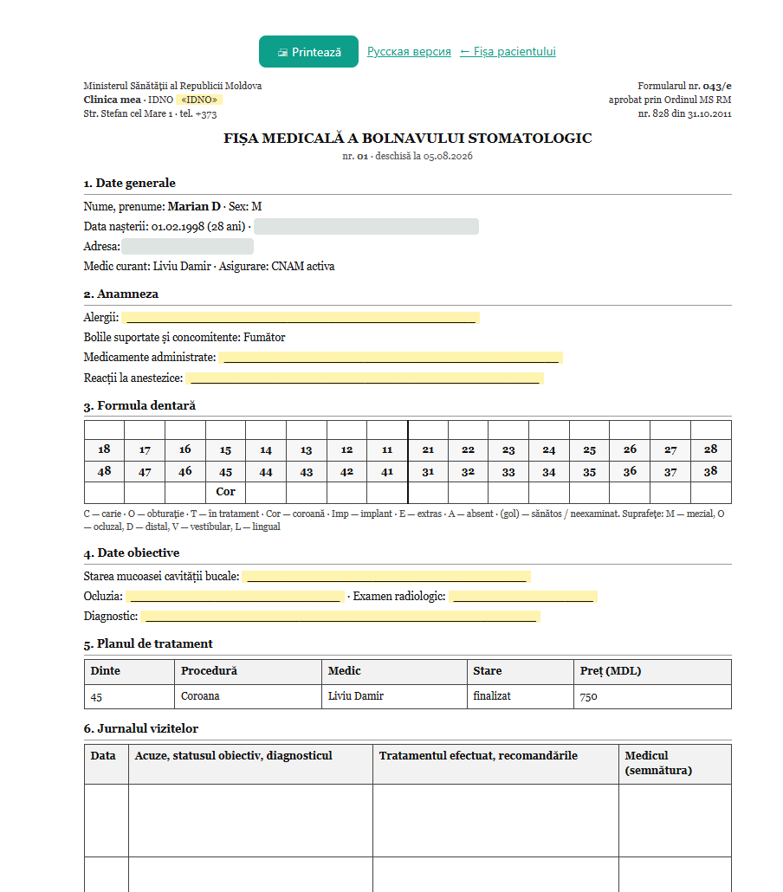
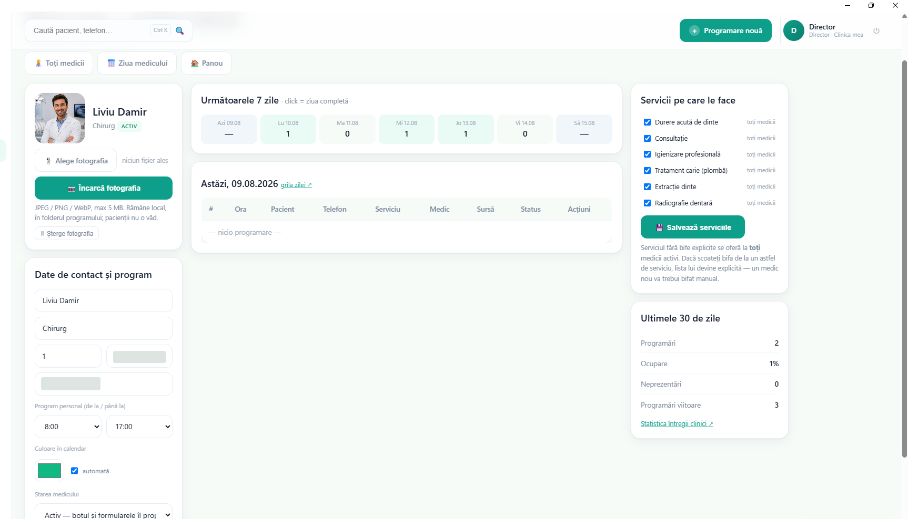

# 🦷 DentPilot — reception journal for dental clinics

A self-hosted practice management system for small dental clinics, built with the Moldovan
market in mind. The clinic runs its whole day in one program: the schedule, patient cards
with an odontogram, treatment plans, an anamnesis questionnaire, payments and documents —
and the medical form the Ministry of Health asks for (**043/e**) prints already filled in
from the card.

Two editions from one codebase: a **desktop app** (`DentPilot.exe`, SQLite next to the exe,
one clinic, one Windows machine) and a **cloud** stack (Docker + PostgreSQL, one VPS
serving many clinics). The desktop edition is the one clinics actually install — there is
no account, no subscription and no server holding patient data.

> Screenshots and `clinic.json` in this repo use synthetic data — invented patients,
> invented doctors. Phone numbers, e-mail addresses and national ID numbers are masked in
> the screenshots. One `clinic.json` = one clinic.

## Screenshots

**Patient card** — odontogram, treatment plan, anamnesis and the activity feed, with
medical alerts and insurance pinned in the header:


**Form 043/e, printed from the card** — letterhead, general data, a numeric odontogram
with its legend, the plan and the visit journal come from the database; the yellow gaps
and the blank rows at the bottom stay for the pen:



**Dashboard** — the day timeline: one column per doctor, blocks drawn to scale by duration,
the "now" line, tiles with a trend against yesterday and a 14-day sparkline each, the
doctors on duty with their chair occupancy, and today's agenda in the right rail:


**Patient list** — filters by doctor, status and channel, derived statuses, a side preview
with treatment-plan progress and CSV export:


**Doctors** — one card per doctor with state, load and 30-day figures; the doctor's own
page holds the working window, the services performed and the calendar colour:




**Owner stats** — money actually taken at the desk kept apart from price-list estimates,
per-doctor occupancy measured in busy minutes rather than in a count of slots, and every
comparison made against the preceding period of the same length:


## Clinic side (`/admin`)

Four views of the schedule:

1. **Dashboard** — the day timeline: one column per doctor, every visit drawn to scale by
   its duration, a red "now" line on today, and overlapping visits split side by side so
   nothing hides behind anything. Above it, day tiles with a trend against yesterday and a
   **14-day sparkline** each, so a number reads as a trend rather than as today's accident;
   each tile is clickable and opens the filtered list. Hours that a long visit runs through
   show *⏳ ocupat* instead of a "+". Each doctor's card carries a **chair-occupancy bar** —
   busy minutes over that doctor's working minutes, the same formula and the same
   `work_minutes()` the *Stats* page uses, so the two screens can never quote different
   percentages for the same doctor. The right rail holds the month calendar and **today's
   agenda** (the day as a time-ordered list, past entries dimmed).
2. **Doctor day view** — single-column schedule, add-form locked to that doctor.
3. **Full grid** — all doctors side by side.
4. **Week view** (`/admin/week`) — seven columns of compact chips with a per-week total.

Clicking **"+"** on any free slot opens a modal: *book a patient* or *leave a note / block
the slot* ("lunch break", "seminar") — a note blocks a whole range. Clicking **any
appointment** opens its card: patient info with age, an editable **reception comment**
(allergies, call-back notes — never visible to patients), a link to the full patient card,
and four status buttons: *arrived*, *finished*, *no-show*, *cancel*.

*Arrived* keeps the slot occupied — moving a patient into the cabinet never frees the hour.
Returning a cancelled visit to an active status is refused if the interval has meanwhile
been taken: the journal shows an "interval occupied" banner instead of silently
double-booking.

Only the pages that show a live schedule reload themselves every 12 seconds. That is a
whitelist, not a default: an auto-reload on a settings page or a patient card costs the
user their scroll position, an open dialog and a half-typed form, which it did three times
before the rule was written down.

### Patient list

`/admin/search` — the clinic's whole base in one working table: avatar and name, phone,
birth date, doctor, last visit (with the next one flagged in green), status, pages. Filters
by doctor, status and channel; sorting by name or by last visit; the current selection can
be exported to CSV or previewed in a side panel that shows the treatment-plan progress,
alerts and documents without leaving the list. Search by name or phone digits (any format),
e-mail or file number, ignoring Romanian diacritics and case ("Balan" finds "Bălan").
Available from the header of any page, or with Ctrl+K.

**Patient status is derived, not stored**: archived → medical alert → unfinished plan → no
visit for a year → active. Nothing to keep in sync, and no status that says "in treatment"
about a patient whose plan was finished last spring. The *Medic* column falls back to the
doctor of the last visit when nobody filled the primary doctor in the card — dimmed, so a
fallback never reads as an assignment.

### Patient card

`/admin/patient/{id}`, opened from search or from any appointment. An avatar with age,
channel and file number; badges assembled from data already there (active / archived,
medical alerts, insurance, implant count taken straight from the odontogram); a KPI row;
then a two-column workspace.

- **Odontogram** — 32 permanent teeth in FDI notation (upper 18→28, lower 48→38) plus the
  **primary dentition** (55→65, 85→75) on a second arch that opens on demand and unfolds by
  itself when a child's tooth already has records. Each tooth is drawn as an actual tooth in
  SVG rather than a coloured box: roots follow anatomy, an implant replaces the root with a
  threaded screw, *in treatment* draws the root-canal axes, an extraction a cross, a missing
  tooth a dashed ghost. Clicking a tooth sets one of eight states with the doctor, the
  affected **surfaces** (M, O, D, V, L) and a short note; the dialog lists that tooth's own
  history. The doctor's name is stored as a snapshot, so renaming a doctor never rewrites
  tooth history. All teeth are generated from one description rather than drawn — see
  *Design decisions*.
- **Treatment plan** — tooth, procedure, doctor, price in MDL, due date. Three statuses
  (planned → in progress → done) move along a directed path the server validates as a pair
  (from, to), tabs filter by status with counts, the total of the *unfinished* plan is shown
  in MDL, and an overdue item is flagged red.
- **Consultations** — a visit diary, one record per appointment, on the rubrics the 043/e
  form asks for: complaints, objective examination, diagnosis, treatment performed,
  recommendations. Templates fill **only empty fields**, so a template never overwrites what
  a doctor typed. There is no delete button: a medical record is corrected, not made to
  disappear. Finishing plan items from the diary bypasses the usual status path on purpose —
  the diary records what actually happened.
- **Anamnesis** — twelve yes/no questions (cardiac, diabetes, coagulation, hepatitis, HIV,
  pregnancy, allergies…) plus four free-text fields, which is exactly what section 2 of the
  043/e sheet wants. It also prints as a **paper questionnaire in the patient's language**,
  because reading twelve questions aloud across the reception desk is not how a waiting room
  works; reception copies the answers into the card afterwards. The paper is not stored as a
  document: the card is the single source of truth, or two versions of the same anamnesis
  would drift apart.
- **Payments and balance** — a payment belongs to the *patient*, not to a procedure, and the
  debt is computed: finalised plan minus paid, negative amounts being refunds. Any role can
  take a payment; only the director can delete one. A patient with payments can no longer be
  physically erased — a cash record is not rewritten after the fact — but anonymisation
  keeps the amounts and clears the notes.
- **Documents and images** — up to 25 MB per file in four categories (X-ray, consent,
  referral, other), a gallery with generated thumbnails, download under the original
  filename. Stored names are random, the extension is whitelisted, and only PNG/JPEG/WebP/GIF
  are ever served inline: an uploaded SVG or HTML would otherwise be a same-origin script
  inside the journal.
- **Medical alerts** in four kinds (allergy, medication, warning, info) — structured data on
  the patient, not a comment attached to one appointment. The first three are pinned as
  coloured pills in the card header, so an allergy is on screen before anyone scrolls.
- **Activity feed** — every change logged with an actor and a timestamp, including who
  merely *opened* the card. Logging never fails the operation it describes.

### Printed documents

- **Fișa 043/e** (`/admin/patient/{id}/fisa043`) — the ministry form, order 828/2011: title
  block from the card, a numeric odontogram with a letter legend on the sheet itself, the
  plan, and the visit diary in chronological order with a signature column and blank rows
  after it.
- **Informare și acord** — an information sheet for signature, filled with the patient's and
  the clinic's data. Treatment runs on a contract and on the law, so the consent checkboxes
  cover only marketing and photography; the grounds listed here must match the sheet on the
  reception desk.
- **Anamnesis questionnaire** for the waiting room, in the patient's language.
- Both the acord and the 043/e print in **Romanian or Russian**, chosen per patient. What is
  never translated: the form code 043/e, the ministry order, the law's name, the authority's
  abbreviation, IDNO/IDNP and the letter codes of the odontogram. The Russian information
  sheet carries a line saying the Romanian version is the authoritative one — otherwise it
  would quietly diverge from the printed sheet at the desk.

### Analytics

`/admin/stats`, director-only: KPI tiles, each with a sparkline of its own series and a
trend **against the preceding period of the same length** (a week compares to the previous
week, a day to yesterday — "vs. last month" for an arbitrary range would be a lie); a
day-by-day line chart with axis labels that thin out on long ranges; booking sources as a
donut — only the channels the program actually knows, nothing invented; average chair
occupancy as a half-circle gauge plus a per-doctor table; **money taken at the desk shown
separately from estimated revenue**, the latter explicitly labelled as a price-list estimate
rather than accounting; top services with value bars; and a recent-activity feed signed with
the *name* of the logged-in employee. All charts are inline SVG from `core/charts.py` — the
program works offline, so a chart library would have to be bundled into the exe wholesale.

### Accounts and roles

Asked for by the first pilot clinic. Three roles: **director** (money, settings, accounts,
the doctors catalogue), **reception** (everything except money and settings, the doctors
catalogue included — leave and working hours are front-desk work) and **doctor** (the
journal and patient cards only). A role is a *set of permissions* in one table, not a string
compared at each route, so "the senior administrator needs reports too" is one line rather
than a hunt through every comparison.

- Login takes **the password alone**; the user id is optional. Reception types it dozens of
  times a day, and demanding an id as well is friction for nothing — so passwords must be
  unique, which the app enforces when an account is created. Otherwise the access log would
  name the wrong person.
- The session cookie signs `uid|role|sid`. That `sid` changes when *that person's* password
  changes, so the director can reset one employee's password without logging out everyone
  else — and without leaving the old tab alive.
- The role is read **from the file by id**, never from the cookie: a demotion takes effect
  immediately, and a deleted account stops working on the very next request.
- Hiding a menu entry is not protection: every restricted route — GET *and* POST — refuses
  on its own, because a URL can be typed and a form can be posted from anywhere.
- At least one director always has to remain. Otherwise the settings lock shut permanently:
  there would be nobody left who could hand the rights back.

### Access from a phone

By default everything binds to `127.0.0.1`. **Acces de pe telefon** in the settings writes
one line into `dental.env`, and the launcher then binds `0.0.0.0` so other machines, phones
and tablets on the clinic's own network open the same journal in a browser; the app window
and the single-instance guard stay on loopback. The page shows a QR to `http://<lan-ip>:port`
and says plainly what this is not: it does not reach the clinic from home. The firewall rule
is created by the program itself through a UAC prompt, because the installer is deliberately
per-user and cannot run `netsh`; its result is read from the **exit code**, never by parsing
the localised text netsh prints.

The `secure` flag is deliberately absent from the session cookie here: over plain HTTP on a
LAN it would break login outright, and the clinic's Wi-Fi encrypts one layer below.

### Doctors and clinic settings

- **Doctors** (`/admin/medici`): one card per doctor — photo (stored locally, never shown to
  patients, validated by file signature rather than by name), room, internal phone, personal
  working window, calendar colour, services performed, and 30-day figures. Three states
  instead of an on/off switch: *active* / *on leave* / *archived*; a doctor is never deleted
  (their appointments keep the link) and archiving is refused while future bookings exist.
- Catalogue edits are gated so the service menu cannot go silently empty: the last active
  doctor cannot be put on leave, and a service may not lose its last *active* performer — a
  list of doctors who are all on leave does not count.
- **Settings** (`/admin/settings`) is a hub of tiles, saved section by section: clinic name,
  phone, address, per-weekday hours with a lunch break, the service table, security, backup,
  updates, and an FAQ page whose answers are versioned in the same commit as the behaviour
  they describe. `clinic.json` is rewritten atomically (tmp + `os.replace`, plus a `.bak`)
  and re-applied in-process — no restart, no hand-edited JSON.
- **Encrypted backup** — the whole clinic (database, files, profile) into one AES ZIP under
  the clinic's own password, written with `pyzipper`. It opens with 7-Zip on any machine
  **without DentPilot installed**, which is the point: a backup that only its own program can
  read is a hostage, not a backup. The instruction on how to open it is stored *unencrypted*
  inside the archive, after the first version locked that note behind the very door it
  explains.

## Patient self-booking (optional, off by default)

A messenger-style booking chat and a **Telegram bot**, both Romanian and Russian, sit on the
same engine and the same database, so a bot booking is already in the journal and a manual
entry already blocks the slot. The whole interface for it — the sidebar section, the QR
sheet, the dashboard tiles — appears only for a clinic that has configured a bot token.
Clinics told us a QR on the door reads as "anyone can book", and asked for reminders they
control instead; the code stays, the shop window does not.

What it does when enabled: language choice first, then service → doctor (or *any
available*) → day → time → name/phone → confirm, with per-service durations offered only
where the *whole* interval fits the doctor's window, clears the lunch break and overlaps
nothing; a separate acute-pain flow that offers the nearest slots including today; "my
appointments" with cancellation; and automatic 24h/2h reminders in the patient's language.

## One file = one clinic

Everything clinic-specific lives in [`clinic.json`](clinic.json): name, phone, address,
contacts, working hours per weekday (with lunch break and days off), doctors with
specialties and state, services with prices, durations and allowed doctors. The engine loads
it at startup (`CLINIC_CONFIG` env) and re-applies it in-process on every save from the
settings page — the compose volume is mounted **read-write** precisely so the journal can
write it back.

A second clinic = a folder with its own `clinic.json` + a compose file pointing at the same
image — see [`examples/clinic-zambet/`](examples/clinic-zambet/): different doctors,
services, prices and a Saturday off, zero code changes.

## Tests

```
.venv-desktop\Scripts\python.exe tests\run_tests.py            # everything, ~95 s
.venv-desktop\Scripts\python.exe tests\run_tests.py журнал     # one suite by name
```

Around 670 checks, standard library only — no pytest, no httpx. `.venv-desktop` is the
*build* environment, and whatever is installed there eventually ends up inside the exe;
tests must also run where nobody can install packages.

Each suite starts **its own server on a free port with its own temporary database** (Windows
happily lets a second process bind a busy port and then routes requests to the first one, so
a fixed port would silently test the wrong server). The clinic used is
`tests/fixtures/clinic_test.json`: open every day 07:00–21:00 so a Sunday-evening run fails
on real breakage rather than on "clinic closed", one archived doctor, and one service nobody
can perform.

One suite starts no server at all. `test_structure.py` parses the sources with `ast` and
holds the layout rules that otherwise live only in prose: no `__file__` outside the two
modules allowed to know where the program sits, no module name computed from `__package__`,
no role compared as a string instead of asking the permission table, no write to `auth.json`
without re-recording its fingerprint. Those are the mistakes that break the *packaged* exe
while leaving a source run perfectly green.

`tests/smoke_exe.py` is separate and answers a different question — does the **built**
program open its pages. `/health` replies without a single file on disk, so it never notices
a lost `--add-data` or a broken path to `static`; those break only in the exe, at the clinic.
`Build-Installer.ps1` runs it and refuses to package a binary whose pages do not open.

## Desktop edition

A single `DentPilot.exe` (PyInstaller, ~30 MB): native app window (WebView2), SQLite next to
the exe, no ports open to the outside. Build with `Build-Desktop.ps1`.

- **First launch writes an empty clinic** — one placeholder doctor, six generic services,
  Mon–Fri 07:00–18:00, Sat 07:00–14:00, no prices borrowed from someone else's list. The demo
  clinic is a *second* bundled profile, chosen only when the installer's demo checkbox left a
  `demo.flag` next to the exe. An invented "Dr. Elena Rusu" in a real journal is worse than a
  demo patient: a live person can be booked to a doctor who does not exist.
- **A PIN of 4–6 digits** per employee, PBKDF2 with 600k iterations in `data\auth.json`.
  Stretching the hash and counting the attempts cure two different attacks and neither
  replaces the other: iterations do nothing against a script hammering the login form, and an
  attempt counter means nothing to someone who already has the file. Failed attempts walk up
  a ladder of pauses. Since the file sits next to the database anyway, the strong hash is
  really protecting a *reused* PIN, not the database.
- **Tamper signal on the auth file** — its SHA-256 lives in the database, and a mismatch at
  startup raises a banner for the director and a line in the activity log. It is a trace, not
  a lock: whoever holds the file holds the unencrypted database next to it.
- **The Telegram token, when used, is encrypted with Windows DPAPI** — a stolen `dental.env`
  is dead on another machine. The flip side is written down rather than discovered: a
  reinstalled Windows or a different account makes that ciphertext unreadable forever, so
  only values the clinic can re-enter are ever encrypted this way.
- **Automatic backup on every start** into `data\backups\` through the SQLite backup API —
  consistent even after a crash with WAL — keeping the last 14.
- **One-click self-update** from GitHub Releases, verified before the swap and reversible if
  it fails — see *Design decisions*.

**Installer**: `Build-Installer.ps1` wraps that exe into a single
`DentPilot-Setup-<version>.exe` (Inno Setup, [`installer/DentPilot.iss`](installer/DentPilot.iss))
— a normal Windows wizard, entirely in Romanian, per-user and x64, no administrator rights.
DentPilot keeps `clinic.json`, `dental.env` and `data\` next to the exe, which decides where
it may be installed: the wizard probes the chosen folder by actually writing to it (Program
Files is rejected), and the default is the **shared** `C:\Users\Public\DentPilot` rather than
a user profile — a clinic where two shifts log in under different Windows accounts must not
end up with two separate databases. Upgrades reuse the existing folder: the database is never
touched, and uninstalling removes only the program, its shortcuts and the update leftovers.

**Update channels.** Clinics stay on `stable` and see only published releases.
`DENTART_CHANNEL=beta` in `dental.env` makes one machine see pre-releases ahead of the
clinics, **with no credential at all**; `draft` additionally needs a GitHub token with write
access. A non-stable machine says so in Settings, so a canary box cannot be mistaken for a
clinic's install. Why it is built this way: *Design decisions*. Release procedure:
[RELEASE.md](RELEASE.md).

## Cloud edition — quick start

```bash
docker compose up -d --build
# clinic journal: http://localhost:8088/admin
```

Reset to a fresh demo dataset: `docker compose down -v && docker compose up -d`.
DB credentials in compose are demo-only; Postgres is bound to loopback.
`Backup-Db.ps1` / `Restore-Db.ps1` dump and restore the database (`--clean`, 14-backup
retention) — the restore path is verified by a fire drill into a throwaway container.

## Data and privacy

The patient card stores a full date of birth, sex, IDNP (validated), insurance, address,
medical alerts, anamnesis answers, consultation records and uploaded documents including
X-rays. That is special-category personal data, and any real deployment has to answer for it.

The design's answer is to keep the data where its controller is — on the clinic's own
machine — and to give the clinic the operations the law expects it to be able to perform:

- **Export everything about one patient** as an archive (right of access and portability).
- **Erasure on two branches**, chosen by what the record contains: a real delete where that
  is allowed, anonymisation where a medical record or a cash record must remain. The
  confirmation is a typed word, not an OK button.
- **Access log** — who opened which card and when, by name, which is what the law asks for
  rather than "channel: reception".
- **Encrypted backup** the clinic can open without this program.
- **Printed information sheet** for signature, plus a document set for the reception desk
  (patient information, processing register, a supplier agreement, a disk-encryption record).

Patient files live on disk, not in the database, in `data/files/<patient_id>`. In the desktop
edition that folder sits next to `dental.db` and survives updates and uninstall. **In the
cloud edition it is inside the container with no volume behind it** — a
`docker compose up -d --build` recreates the container and the uploads are gone, and
`Backup-Db.ps1` dumps Postgres only. Add a volume before putting real files there.

The database itself is still a plain SQLite file; disk encryption (BitLocker) is the measure
in place today, and the program reports its status on the security page.

Access: the desktop journal is behind the PIN, and an empty `ADMIN_KEY` does not mean an open
journal — the setup screen appears instead. The cloud edition refuses to start without
`ADMIN_KEY` (HMAC cookie).

## Stack

- FastAPI + Uvicorn; PostgreSQL 16 + asyncpg in the cloud, SQLite + aiosqlite on the desktop
  — one schema, two dialects, additive migrations.
- The dialog engine is channel-agnostic (`engine.handle()`): the web chat and the Telegram
  adapter (aiogram, inline keyboards; enabled by setting `TELEGRAM_TOKEN`) are two thin
  adapters over the same engine and database.
- The journal and the booking engine share one database by design — "integration" is a query,
  not a sync job.
- Reviewed adversarially (multi-agent code review) before releases; findings are fixed and
  covered by regression suites in the same commit.

## Design decisions

The parts that were not obvious, and what each one cost to get right.

### The odontogram is generated, not drawn

32 permanent teeth, eight states each, 20 primary teeth on a second arch, and the two arches
are mirror images. Drawing that by hand is dozens of files that drift apart the first time
the shape changes. Instead there is one contour per tooth class, a width coefficient and a
root-count rule — upper molars three roots, lower molars and the upper first premolar two,
everything else one — and the upper arch is the same code flipped
([`bot/app/teeth_svg.py`](bot/app/teeth_svg.py)).

The primary dentition is not that code with different numbers. Quadrants 5–8 decide which
arch a tooth belongs to, and positions 4 and 5 there are **molars**, because a child has no
premolars — precisely the detail a "just renumber it" implementation gets wrong in the place
a dentist looks first.

The same idea covers the brand: the program's mark exists once as geometry
([`bot/app/brand.py`](bot/app/brand.py)) and is rendered two ways — PIL for the `.ico`
Windows shows on the desktop, SVG for the interface. They cannot drift apart because there is
nothing to keep in sync.

### A printed form has to survive the pen

The 043/e sheet is not a screenshot of the database. Everything the program knows for certain
— patient, doctor, teeth, plan, visit journal — is printed. Everything the dentist writes at
the chair — mucosa, occlusion, the radiological exam — is printed as a **yellow gap**, and
the visit journal ends with blank rows and a signature column. A form that leaves no room for
handwriting is a form the clinic stops using by the second week.

What is deliberately *not* promised is a pixel copy of the typographic blank: the sections
and their order match order 828/2011 and the sheet says so in its header, but imitating the
printing house is a claim nobody can honour across printers.

### The canary channel carries no secret

Before a release reaches clinics it runs for a day on one machine. The first version did that
with GitHub **draft** releases, which are invisible without a token — so the canary machine
had to keep a token that could push code, in a file next to the exe, in a folder every
Windows account on that machine can read. That is a large payment for hiding a build from
people who are not looking for it.

**Pre-releases** cost nothing. They are public, so no key is involved, and a clinic still
cannot reach one: on `stable` the updater asks exactly one endpoint, `/releases/latest`,
which by construction serves neither drafts nor pre-releases. The guard is an endpoint with
nothing extra to show, not a filter someone can loosen by accident later.

Getting there cost an evening to a wrong conclusion. A read-only token reports *zero drafts*
— not "access denied", just zero — because GitHub shows drafts only to callers who can write.
Three sources agreed there was no draft; all three were blind for the same reason, which
makes them one source. The lesson that stuck: a negative result needs proof that the
instrument could have seen the thing at all.

### Double-booking outlived its own defence

Unique indexes on `(doctor, starts_at)` and `(patient_id, starts_at)` made overlapping
bookings impossible — until appointments got durations. 10:00 for sixty minutes and 10:30 for
sixty minutes collide without sharing a start, and an index on the start column cannot see
it. The real guard is an interval test and the insert under one lock.

That lock is per process. Both editions run a single worker today (the desktop app has a
single-instance guard), so it holds — and it is written down as a limit rather than left as
an assumption for whoever scales the cloud edition past one worker.

### Never identify a failure by the engine's wording

The same violation is reported differently by the two backends: SQLite names the *columns*,
PostgreSQL names the *index*. A check written as "is our index name in this message" was
therefore true on one edition and quietly false on the other, and the clinic saw "this hour
is taken for the doctor" where the truth was "this patient already has an appointment then".
The booking code now asks the question before inserting instead of parsing what the engine
says afterwards.

A neighbouring version of the same trap: a computed date arrives from PostgreSQL as a
timestamp and from SQLite as a **string**, so an aliased date column has to be declared in
one list in the data layer. Forget it and the code works in the cloud and raises at the
clinic.

### A new clinic starts empty

First launch writes a blank profile: one placeholder doctor, six generic services, no prices
borrowed from someone else's list. The demo clinic is a second bundled profile, used only
when the installer's demo checkbox left a flag next to the exe.

This was a bug first. An early version left the demo doctors in a real clinic's journal, and
a real patient can be booked to a doctor who does not exist — which is worse than a demo
patient, because it looks like data rather than like a sample.

### Updating without breaking the clinic

One click, and the risk is that the clinic ends up with no working program at all. So the
download is checked against the release's byte size and SHA-256 before anything is touched: a
truncated 30 MB download raises no exception in `urllib` and used to overwrite the working
exe in silence. The swap moves the running program aside and puts it back if the new file
does not land, so a failed update is distinguishable from a deleted one. The asset name is
matched exactly, because the installer sitting next to it in the same release would otherwise
be pulled in as the program.

Migrations are additive by rule — new columns, never a rewrite — because the desktop edition
upgrades in place on a machine nobody administers, and there is no way to roll a clinic back
at 9am on a Monday.

### A new door makes old locks visible

Adding LAN access did not create a permission hole; it exposed one that had been there since
roles were introduced. The doctors catalogue had never been put behind a permission, which
nobody could reach while everything bound to loopback — and the day a doctor opened the
journal from a phone, he could edit his colleagues' cards. The rule that came out of it: every
time the surface grows, the permission audit runs again, not only the feature's own tests.

### Guardrails that assume a tired receptionist

The catalogue refuses edits that would silently empty the service menu: the last active
doctor cannot be put on leave, and a service may not lose its last *active* performer — a
list of doctors who are all on holiday does not count. That rule exists because it once did
not: a service quietly vanished while the journal showed a green "saved" banner.

In the same spirit, *arrived* keeps the slot occupied rather than freeing the hour, and
returning a cancelled visit to an active status is refused if the interval has meanwhile been
taken.

## Roadmap

- SMS package: reminders and confirmations the clinic controls, which is what clinics ask for
  instead of a public booking link.
- Cash report for the day, and a debt column in the patient list.
- Storage periods and scheduled clean-up, the last open item under the new data-protection law.
- Multi-tenant single instance (today: one lightweight compose stack per clinic).

## Pe scurt / Кратко

Registru pentru clinici stomatologice: programul zilei, fișa pacientului cu odontogramă,
plan de tratament, anamneză, plăți și documente, cu fișa 043/e tipărită din program. O
clinică nouă = un singur fișier `clinic.json`. / Журнал для стоматологий: расписание,
карточка пациента с одонтограммой, план лечения, анамнез, платежи и документы, с печатью
формы 043/e из программы. Новая клиника = один файл `clinic.json`.

## License

**Source-available, not open source.** © 2026 Oleg Bacalu, all rights reserved. The code is
here to be read; using it in a product, redistributing it or building on it needs written
permission — see [LICENSE](LICENSE). Versions published before 2026-08-04 went out under MIT,
and that grant is not withdrawn for them.

Compiled releases are licensed to the clinic that installs them, for its own use.
Permissions: dentpilotpro@gmail.com
